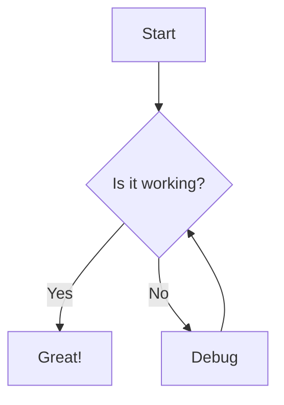

# Mermaid Flow Diagrams

Flow diagrams are a super helpful part of documenting code processes and workflows, but they can be a pain to create. Mermaid lets you create diagrams using markdown-like syntax, which is great for version control and documentation.

Here's a simple example of a flow diagram showing a debugging process:

<!--  -->

The code to generate this diagram is straightforward:

